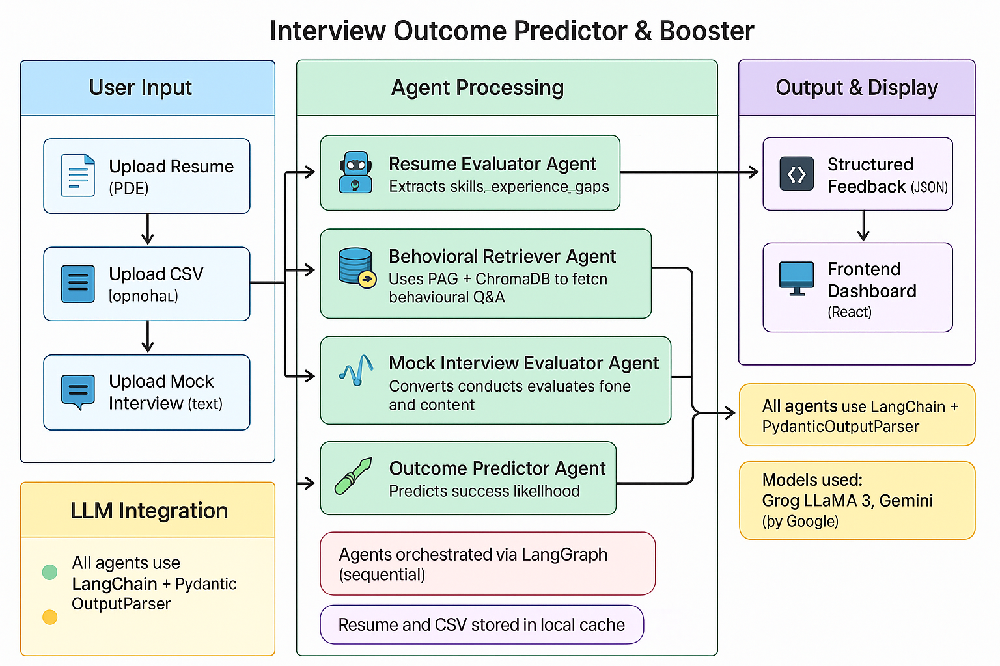

# 🧠 Interview Outcome Predictor & Booster

A modular, agent-powered AI system that analyzes a candidate’s resume, evaluates mock interview responses, predicts interview success, and recommends personalized improvement suggestions with learning resources.

---

## 🚀 Features

- 📄 **Resume Analysis**: Scores resume on clarity, relevance, structure, and experience.
- 💬 **Behavioral Patterns Generator**: Provides job-specific behavioral questions with sample answers.
- 🎤 **Mock Interview Evaluator**: Evaluates candidate response on tone, relevance, and confidence.
- 📈 **Outcome Predictor**: Predicts interview success score based on combined metrics.
- 🧭 **Improvement Planner**: Suggests actionable improvements and curated learning resources.
- 🌐 **FastAPI Backend**: Robust API endpoints for full and individual pipeline steps.
- 🔗 **LangChain + LangGraph**: Modular agent graph for clean, explainable pipeline flow.

---

## 🛠️ Tech Stack

| Layer          | Tools & Libraries                                   |
| -------------- | --------------------------------------------------- |
| Language Model | [Groq LLaMA-3](https://groq.com), Gemini (optional) |
| LangChain      | `langchain`, `langgraph`, `langchain_groq`          |
| Backend        | `FastAPI`, `pydantic`, `pdfplumber`, `docx2txt`     |
| LLM Evaluation | Prompt engineering + structured JSON parsing        |
| Deployment     | Run locally or via containerized API                |

---

## 📦 Folder Structure

📦 Project Root
├── 🧩 frontend/ # UI (Streamlit or React)
│
├── 🛠️ backend/ # Core backend logic
│ ├── 🤖 agents/ # Modular AI agents
│ │ ├── resume_analyzer.py # Analyze resume strength
│ │ ├── behavioral_retriever.py # RAG-based behavioral Q&A retriever
│ │ ├── mock_evaluator.py # Evaluate mock interview answers
│ │ ├── outcome_predictor.py # Predict interview outcome
│ │ └── gap_fixer.py # Recommend improvements
│ │
│ ├── orchestrator.py # LangGraph orchestration of agents
│ ├── api.py # FastAPI endpoints
│ ├── prompts/ # Prompt templates used by agents
│ ├── database/ # DB models and setup scripts
│ └── tests/ # Unit & integration tests
| | requirements.txt
│
└── .env # Environment variables (excluded from git)

## 

## 📌 Setup Instructions

Follow these steps to get the backend API server up and running:

1.  **Clone the Repository**

    ```bash
    git clone
    cd backend
    cd frontend  -> npm start
    ```

2.  **Create and Activate Virtual Environment**

    ```bash
    python -m venv venv
    # On macOS/Linux:
    source venv/bin/activate
    # On Windows:
    # venv\Scripts\activate
    ```

3.  **Install Dependencies**

    ```bash
    pip install -r requirements.txt
    ```

4.  **Configure Environment Variables**
    Create a `.env` file in the `backend/` directory and populate it with your API keys:

    ```ini
    # .env
    GROQ_API_KEY=your_groq_api_key_here
    TAVILY_API_KEY=your_tavily_api_key_here
    HUGGINGFACEHUB_API_TOKEN=your_huggingface_api_token_here
    GOOGLE_API_KEY=your_google_api_key_here
    ```

    - **GROQ_API_KEY**: Get from [Groq Console](https://console.groq.com/keys)
    - **TAVILY_API_KEY**: Get from [Tavily API](https://tavily.com/dashboard/settings)
    - **HUGGINGFACEHUB_API_TOKEN**: Optional, for HuggingFace embeddings fallback. Get from [Hugging Face](https://huggingface.co/settings/tokens)
    - **GOOGLE_API_KEY**: Optional, for Google Generative AI embeddings. Get from [Google AI Studio](https://aistudio.google.com/app/apikey)

5.  **Run the FastAPI Server**
    ```bash
    uvicorn api:app --reload
    ```
    The API will be accessible typically at `http://127.0.0.1:8000`. You can test the endpoints using tools like Postman, Insomnia, or directly through your browser at `http://127.0.0.1:8000/docs` for the Swagger UI.

---

## 💡 Example JSON Output

This is an example of the comprehensive JSON output you would receive from the system after a full evaluation cycle:

```json
{
  "resume_scores": {
    "clarity": 85,
    "relevance": 78,
    "structure": 90,
    "experience": 2,
    "feedback": ["Quantify project outcomes", "Align skills to job"]
  },
  "mock_scores": {
    "tone": 72,
    "confidence": 64,
    "relevance": 75,
    "feedback": ["Be more concise", "Highlight results"]
  },
  "outcome": {
    "success_score": 69,
    "reason": "Good structure and tone, but lacks confident delivery and alignment."
  },
  "improvement_plan": {
    "suggestions": [
      {
        "title": "Improve confidence",
        "description": "Practice speaking clearly in mock interviews"
      },
      {
        "title": "Reframe achievements",
        "description": "Use STAR format to explain past work"
      }
    ],
    "resources": [
      {
        "title": "Mock Interview Practice",
        "link": "[https://interviewing.io/](https://interviewing.io/)"
      },
      {
        "title": "Resume Alignment Tips",
        "link": "[https://careersidekick.com/](https://careersidekick.com/)"
      }
    ]
  }
}
```
